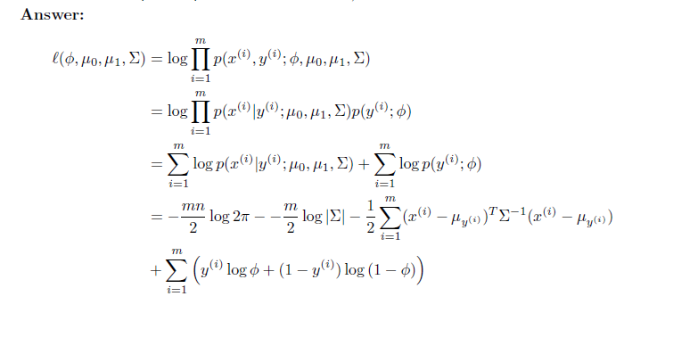
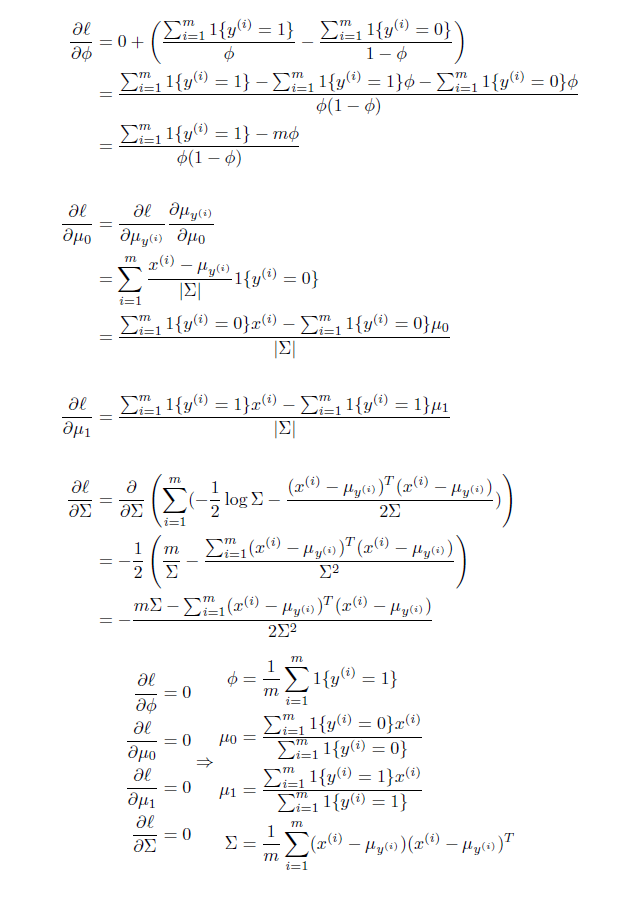
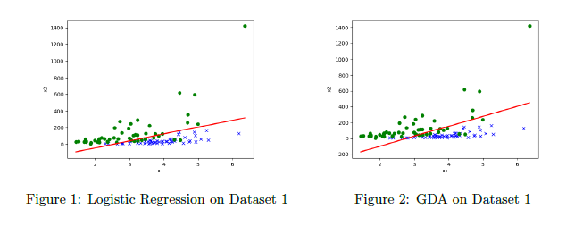
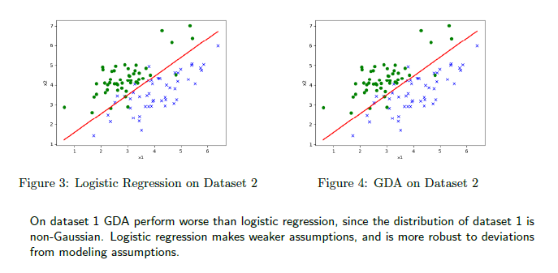

# CS229(Autumn 2018) problem sets

## Overview
这是我学习吴恩达机器学习（Stanford cs229）的记录。

- 课程大纲: [here](http://cs229.stanford.edu/syllabus-autumn2018.html)
- 课程视频: [youtube](https://www.youtube.com/watch?v=jGwO_UgTS7I&list=PLoROMvodv4rMiGQp3WXShtMGgzqpfVfbU)
- 我的解答可以查看这三个pdf，主要包括机器学习算法的公式推导，代码实现以及一些可视化等等，均为独立完成：
  - PS1: [PDF here](./ps1/tex/ps1.pdf)
  - PS2: [PDF here](./ps2/tex/ps2.pdf)
  - PS3: [PDF here](./ps3/tex/ps3.pdf)


以高斯判别分析（GDA）为例（[详见pdf 5-9页](./ps1/tex/ps1.pdf)）：
1. 公式推导：   



2 代码实现:
```Python
import numpy as np
import util

from linear_model import LinearModel


def main(train_path, eval_path, pred_path):
    """Problem 1(e): Gaussian discriminant analysis (GDA)

    Args:
        train_path: Path to CSV file containing dataset for training.
        eval_path: Path to CSV file containing dataset for evaluation.
        pred_path: Path to save predictions.
    """
    # Load dataset
    x_train, y_train = util.load_dataset(train_path, add_intercept=False)

    # Train a GDA classifier
    model = GDA()
    model.fit(x_train, y_train)

    # Plot decision boundary on validation set
    x_valid, y_valid = util.load_dataset(eval_path, add_intercept=True)
    util.plot(x_valid, y_valid, model.theta, '{}.png'.format(pred_path[:-4]))

    # Save results
    y_pred = model.predict(x_valid)
    np.savetxt(pred_path, y_pred)


class GDA(LinearModel):
    """Gaussian Discriminant Analysis.

    Example usage:
        > clf = GDA()
        > clf.fit(x_train, y_train)
        > clf.predict(x_eval)
    """

    def fit(self, x, y):
        """Fit a GDA model to training set given by x and y.

        Args:
            x: Training example inputs. Shape (m, n).
            y: Training example labels. Shape (m,).

        Returns:
            theta: GDA model parameters.
        """
        m, n = x.shape

        # Find phi, mu_0, mu_1, and sigma
        phi = sum(y == 1) / m
        mu_0 = sum(x[y==0, :]) / sum(y == 0)
        mu_1 = sum(x[y==1, :]) / sum(y == 1)
        mu = np.zeros(x.shape)
        mu[y==0, :] = mu_0
        mu[y==1, :] = mu_1
        new_x = x - mu
        sigma = (new_x.T).dot(new_x) / m

        # Write theta in terms of the parameters
        theta = np.dot(np.linalg.inv(sigma), (mu_1-mu_0).T)
        theta_0 = 1/2*(np.dot(mu_0, np.linalg.inv(sigma)).dot(mu_0.T) -
                       np.dot(mu_1, np.linalg.inv(sigma)).dot(mu_1.T)) + np.log(phi/(1-phi))
        self.theta = np.hstack([theta_0, theta])

    def predict(self, x):
        """Make a prediction given new inputs x.

        Args:
            x: Inputs of shape (m, n).

        Returns:
            Outputs of shape (m,).
        """
        return 1/(1 + np.exp(-(x.dot(self.theta))))
```

3. 可视化和对比    
   
   


Note: 还有很多其他例子，详见开头的pdf链接。